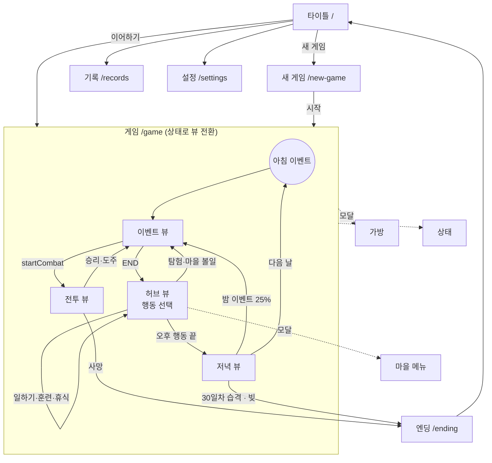

# 보리울의 30일 — 구현 아키텍처 & 개발 로드맵 (v0.1)

> 스택: **React Native (Expo) + TypeScript + Zustand**
> 상위 문서: [게임 기획서](GAME_DESIGN.md) · [시스템 상세 설계서](SYSTEM_SPEC.md)
> 대상 독자: JS 게임 개발 경험은 있지만 React Native는 처음인 1인 개발자

> 💡 표시가 붙은 상자는 React Native에서 처음 보게 될 개념을 짧게 설명한 것이다.

---

## 0. 큰 그림: 3개 층

```
┌─────────────────────────────────────────────┐
│ UI 층  (src/app/, src/ui/)                  │  React Native 컴포넌트
│   - 상태를 "읽어서 그리기"                  │  화면, 버튼, 애니메이션
│   - 사용자 입력을 "명령(Command)"으로 전달  │
└───────────────▲──────────────┬──────────────┘
                │ 구독(selector)│ send(command)
┌───────────────┴──────────────▼──────────────┐
│ 상태 층  (src/store/)                       │  Zustand
│   - 현재 RunState 보관                      │
│   - 명령을 엔진에 넘기고 결과로 교체        │
│   - 저장 시점 관리                          │
└───────────────▲──────────────┬──────────────┘
                │ 새 상태+피드  │ dispatch(state, command)
┌───────────────┴──────────────▼──────────────┐
│ 코어 층  (src/core/)                        │  순수 TypeScript
│   - 주사위, 판정, 전투, 이벤트, 하루 진행   │  React/RN import 금지
│   - 데이터(JSON)는 인자로 받기만 함         │  Node에서 테스트·시뮬레이션
└─────────────────────────────────────────────┘
```

**규칙 하나만 기억하면 된다: `src/core`는 `react`, `react-native`, `zustand`, `expo-*`를 절대 import하지 않는다.**
그래야 게임 로직을 폰 없이 터미널에서 테스트하고, 1,000판 자동 시뮬레이션으로 밸런스를 잡을 수 있다. (ESLint `no-restricted-imports`로 강제)

---

## 1. 프로젝트 폴더 구조

```
TRPG/
├─ src/
│  ├─ app/                    # 화면 (Expo Router: 파일 하나 = 화면 하나)
│  │  ├─ _layout.tsx             # 루트 레이아웃: 폰트·테마·저장 데이터 로딩
│  │  ├─ index.tsx               # 타이틀
│  │  ├─ new-game.tsx            # 이름 입력 + 직업 선택
│  │  ├─ game/
│  │  │  ├─ _layout.tsx          # 게임 공통: 상단 상태 바
│  │  │  ├─ index.tsx            # 게임 본 화면 (상태 머신으로 뷰 전환)
│  │  │  ├─ inventory.tsx        # 모달: 가방·장비
│  │  │  ├─ status.tsx           # 모달: 능력치·숙련·흔적
│  │  │  └─ town.tsx             # 모달: 상점·대장간·의원·여관
│  │  ├─ ending.tsx              # 엔딩 / 사망
│  │  ├─ records.tsx             # 기록·도감
│  │  ├─ settings.tsx
│  │  └─ dev/dice.tsx            # 1주차 개발용 판정 테스트 화면
│  │
│  ├─ core/                      # ★ 게임 로직 (순수 TS)
│  │  ├─ types.ts                # SYSTEM_SPEC.md에서 자동 생성 (수정 금지)
│  │  ├─ content.ts              # ContentDB 타입 + 조회 헬퍼
│  │  ├─ engine.ts               # dispatch(state, command, content) — 유일한 진입점
│  │  ├─ commands.ts             # GameCommand, FeedItem 타입
│  │  ├─ newRun.ts               # 직업 → 초기 RunState
│  │  ├─ check/
│  │  │  ├─ modifiers.ts         # 상태 → CheckContext 조립 (보정·유불리)
│  │  │  └─ progress.ts          # XP·등급업·능력치 성장
│  │  ├─ day/
│  │  │  ├─ actions.ts           # 일하기·훈련·휴식 등 행동 처리
│  │  │  └─ evening.ts           # 저녁 정산 8단계
│  │  ├─ events/
│  │  │  ├─ conditions.ts        # evalCondition
│  │  │  ├─ effects.ts           # applyEffect
│  │  │  ├─ selector.ts          # 이벤트 풀 필터·가중치 추첨
│  │  │  ├─ runner.ts            # 장면 진입·선택지 처리
│  │  │  └─ text.ts              # 텍스트 변형·{name} 치환
│  │  ├─ combat/
│  │  │  ├─ combat.ts            # 라운드 진행
│  │  │  └─ damage.ts            # 주사위 표기 파싱·피해 계산
│  │  ├─ items/
│  │  │  ├─ inventory.ts         # 넣기·빼기·겹치기·장착
│  │  │  └─ shop.ts              # 가격·수리·치료
│  │  ├─ story/
│  │  │  └─ ending.ts            # 엔딩 판정
│  │  └─ save/
│  │     ├─ serialize.ts         # RunSaveFile 만들기·검증
│  │     └─ migrations.ts
│  │
│  ├─ data/                      # ★ 콘텐츠 (JSON)
│  │  ├─ jobs.json
│  │  ├─ items.json
│  │  ├─ enemies.json
│  │  ├─ npcs.json
│  │  ├─ events/
│  │  │  ├─ story/*.json
│  │  │  ├─ morning/*.json
│  │  │  ├─ forest/*.json
│  │  │  ├─ watchtower/*.json
│  │  │  ├─ npc/*.json
│  │  │  └─ night/*.json
│  │  ├─ content.generated.json  # 빌드 스크립트가 합친 결과 (git 무시 가능)
│  │  └─ index.ts                # content.generated.json → ContentDB
│  │
│  ├─ store/                     # ★ 상태 관리 (Zustand)
│  │  ├─ gameStore.ts            # 진행 중 회차 + send()
│  │  ├─ metaStore.ts            # 기록·설정
│  │  ├─ storage.ts              # AsyncStorage 래퍼 (원자적 쓰기·백업)
│  │  └─ selectors.ts            # 화면용 파생값 (현재 뷰, 성공 확률 등)
│  │
│  └─ ui/
│     ├─ components/             # StatusBar, StoryText, ChoiceButton, DiceRoll, BottomSheet ...
│     ├─ views/                  # 게임 화면 안의 뷰: HubView, EventView, CombatView, EveningView
│     ├─ hooks/                  # useFeedPlayer 등
│     └─ theme.ts                # 색·글꼴 크기·여백 토큰
│
├─ schemas/                      # types.ts에서 생성한 JSON Schema (편집기 자동완성·검증용)
├─ scripts/
│  ├─ extract-types.mjs          # SYSTEM_SPEC.md → src/core/types.ts (이미 있음)
│  ├─ gen-schemas.mjs            # types.ts → schemas/*.schema.json
│  ├─ build-content.ts           # data/**/*.json 합치기 + 검증 → content.generated.json
│  └─ simulate.ts                # 자동 플레이·전투 밸런스 시뮬레이션
├─ tests/core/                   # vitest 단위 테스트 (코어만)
└─ docs/
```

> 💡 **Expo**: React Native 앱을 네이티브 빌드 설정 없이 시작하게 해 주는 도구 모음. 개발 중에는 폰에 **Expo Go** 앱을 깔고 QR코드를 찍으면 코드가 바로 반영된다(저장 → 1초 뒤 폰 화면 갱신). 스토어 배포용 빌드는 **EAS Build**(클라우드 빌드)로 만든다.

> 💡 **Expo Router**: `src/app/` 폴더의 파일 경로가 그대로 화면 주소가 된다(`app/`도 되지만 SDK 57 템플릿은 `src/app/`을 권장). `src/app/game/inventory.tsx` → `/game/inventory`. `_layout.tsx`는 같은 폴더 화면들을 감싸는 공통 틀이다. 웹의 Next.js와 같은 방식.

### 시작 명령
```bash
npx create-expo-app@latest . --template blank-typescript   # 기존 docs/scripts는 그대로 둔다
npx expo install expo-router react-native-safe-area-context react-native-screens expo-linking expo-constants expo-status-bar
npx expo install @react-native-async-storage/async-storage expo-haptics
npm i zustand immer
npm i -D vitest tsx ajv ts-json-schema-generator eslint
```
- `npx expo install`은 현재 Expo 버전과 **호환되는 버전**을 골라 설치한다. RN 관련 패키지는 `npm i` 대신 이걸 쓴다.
- `tsconfig.json`은 `"extends": "expo/tsconfig.base"`로 바꾸고 `strict: true` 유지. 현재 루트의 `tsconfig.json`이 그 출발점이다.

---

## 2. 데이터(JSON) 스키마

### 2-1. 원칙
1. **타입의 원본은 `src/core/types.ts`**(= SYSTEM_SPEC.md). JSON 스키마는 여기서 **생성**한다. 손으로 두 벌 관리하지 않는다.
2. 편집기에서 JSON을 쓸 때 자동완성·빨간 줄이 뜨도록 각 파일 첫 줄에 `$schema`를 단다.
3. 앱 실행 전에 `build-content`가 **구조 검증 + 참조 검증**을 하고, 하나라도 틀리면 빌드를 멈춘다.

> 💡 **Metro 번들러에는 파일 시스템이 없다.** RN 앱은 실행 시점에 `fs.readdir`로 폴더를 읽을 수 없고, `require()`도 경로가 문자열 상수여야 한다. 그래서 JSON 수백 개를 **미리 한 파일로 합쳐서** import한다. (`build-content.ts`가 이 일을 한다)

### 2-2. 파일 단위
| 데이터 | 파일 | 이유 |
|--------|------|------|
| 이벤트 | **이벤트 1개 = 파일 1개** (`data/events/forest/forest_wolf_01.json`) | 135개를 한 파일에 넣으면 편집·diff가 지옥 |
| 아이템 | `items.json` 한 파일 (배열) | 20여 개, 표처럼 한눈에 비교 |
| 몬스터 | `enemies.json` 한 파일 (배열) | 밸런스 조정 시 나란히 비교 |
| 직업 | `jobs.json` | 3~5개 |
| NPC | `npcs.json` | 이름·초상 아이콘·대화 풀 연결 |

### 2-3. 스키마 생성
```js
// scripts/gen-schemas.mjs
import { createGenerator } from "ts-json-schema-generator";
import { writeFileSync, mkdirSync } from "node:fs";

const targets = { EventDef: "event", ItemDef: "item", EnemyDef: "enemy", JobDef: "job" };
mkdirSync("schemas", { recursive: true });
for (const [type, name] of Object.entries(targets)) {
  const schema = createGenerator({ path: "src/core/types.ts", tsconfig: "tsconfig.json", type }).createSchema(type);
  writeFileSync(`schemas/${name}.schema.json`, JSON.stringify(schema, null, 2));
}
```
- 배열 파일용(`items.json` 등)은 `{ "type": "array", "items": { "$ref": "item.schema.json" } }` 한 줄짜리 래퍼를 둔다.
- `DiceExpr`(템플릿 리터럴 타입)가 생성기에서 정확히 변환되지 않으면 해당 필드만 `"pattern": "^\\d+d\\d+([+-]\\d+)?$"`로 후처리한다.

### 2-4. JSON 예시

**이벤트** — `src/data/events/forest/forest_herb_01.json`
```json
{
  "$schema": "../../../../schemas/event.schema.json",
  "id": "forest_herb_01",
  "category": "explore",
  "region": "forest",
  "title": "이끼 낀 바위 아래",
  "conditions": [],
  "weight": 12,
  "repeat": { "mode": "cooldown", "days": 3 },
  "dangerTier": 1,
  "startScene": "start",
  "scenes": {
    "start": {
      "text": "바위 틈에 잎이 톱니 모양인 풀이 자라 있다. 약초일까, 독초일까.",
      "choices": [
        {
          "id": "inspect",
          "label": "잎을 자세히 살펴본다",
          "check": { "stat": "per", "skill": "herbalism", "dc": 10 },
          "outcomes": {
            "success": { "text": "약초다. 조심스럽게 캤다.", "effects": [{ "type": "addItem", "itemId": "herb", "qty": 2 }], "next": "END" },
            "fail": { "text": "확신이 서지 않아 그냥 두었다.", "next": "END" },
            "critFail": { "text": "독초였다. 손끝이 저려 온다.", "effects": [{ "type": "hp", "delta": -2 }], "next": "END" }
          }
        },
        { "id": "leave", "label": "그냥 지나간다", "outcome": { "next": "END" } }
      ]
    }
  }
}
```

**몬스터** — `src/data/enemies.json`
```json
[
  {
    "id": "wolf", "name": "늑대",
    "hp": 6, "defense": 11, "attackBonus": 3, "damage": "1d6", "speed": 4,
    "morale": 0.5, "onDefeat": "deathSave", "tags": ["beast"],
    "loot": [{ "itemId": "wolf_pelt", "qty": 1, "chance": 0.8 }],
    "food": 1
  },
  {
    "id": "goblin_scout", "name": "고블린 정찰병",
    "hp": 6, "defense": 12, "attackBonus": 2, "damage": "1d4+1", "speed": 3,
    "morale": 0.5, "onRoutFlag": "goblin_alerted", "onDefeat": "deathSave", "tags": ["goblin"],
    "loot": [{ "itemId": "goblin_token", "qty": 1, "chance": 1 }]
  }
]
```

**아이템** — `src/data/items.json`
```json
[
  { "id": "rusty_sword", "name": "녹슨 검", "category": "weapon", "description": "날이 무디지만 검은 검이다.",
    "price": 15, "sellable": true, "stackMax": 1,
    "skill": "blade", "damage": "1d6", "twoHanded": false, "durabilityMax": 20 },
  { "id": "bandage", "name": "붕대", "category": "consumable", "description": "깨끗한 천 조각.",
    "price": 3, "sellable": true, "stackMax": 5,
    "use": [{ "type": "healWound", "to": "none" }], "usableInCombat": false }
]
```

### 2-5. 참조 검증 (구조 검증만으로는 못 잡는 실수)
`build-content.ts`에서 ajv 구조 검증 뒤에 다음을 검사한다.

| 검사 | 예 |
|------|----|
| ID 중복 | 이벤트 두 개가 `forest_wolf_01` |
| 아이템·적·흔적 참조 존재 | `addItem: "herbb"` 오타 |
| 장면 참조 존재 | `next: "fihgt"`, `startScene`이 없는 장면 |
| 도달 불가 장면 | 어떤 `next`도 가리키지 않는 장면 (경고) |
| 끝나지 않는 이벤트 | `END`에 도달할 수 없는 순환 (오류) |
| UI 제약 | 선택지 5개 이상, 장면 텍스트 220자 초과 (경고) |
| 판정 분기 | `check`가 있는데 `success`/`fail` 누락 |

```ts
// scripts/build-content.ts (뼈대)
const content: ContentDB = { events: {}, items: {}, enemies: {}, jobs: {} };
const errors: string[] = [];
for (const file of glob("src/data/events/**/*.json")) {
  const ev = readJson(file);
  if (!validateEvent(ev)) errors.push(`${file}: ${ajvErrors(validateEvent)}`);
  if (content.events[ev.id]) errors.push(`${file}: 중복 ID ${ev.id}`);
  content.events[ev.id] = ev;
}
// ... items, enemies, jobs
errors.push(...checkReferences(content));
if (errors.length) { console.error(errors.join("\n")); process.exit(1); }
writeFileSync("src/data/content.generated.json", JSON.stringify(content));
```
`package.json`에 `"prestart": "tsx scripts/build-content.ts"`를 걸어 두면 `npm start` 때마다 자동으로 돈다.

---

## 3. 게임 로직과 UI 분리 구조

### 3-1. 명령(Command) → 엔진 → 새 상태 + 피드(Feed)
UI가 할 수 있는 일은 **명령을 보내는 것뿐**이다. 엔진은 새 상태와 함께, 화면이 순서대로 연출할 **피드**(텍스트·주사위·피해 숫자)를 돌려준다.

```ts
// src/core/commands.ts
export type GameCommand =
  | { type: "chooseAction"; action: DailyActionId; region?: RegionId; skill?: SkillId; stat?: StatId }
  | { type: "chooseChoice"; choiceId: string }
  | { type: "continue" }                                   // "계속" 버튼
  | { type: "goDeeper"; yes: boolean }                     // 탐험 3번째 카드
  | { type: "combat"; action: CombatAction }
  | { type: "eveningFeedOrder"; order: "selfFirst" | "familyFirst" }
  | { type: "equip"; slotIndex: number }
  | { type: "useItem"; itemId: ItemId }
  | { type: "discard"; slotIndex: number }
  | { type: "shop"; op: "buy" | "sell" | "repair" | "treat" | "buyFood" | "payDebt"; target?: string; qty?: number };

export type FeedItem =
  | { kind: "text"; text: string }
  | { kind: "roll"; label: string; result: CheckResult }
  | { kind: "damage"; target: "player" | string; amount: number; crit: boolean }
  | { kind: "resource"; key: "silver" | "food" | "hp" | "fatigue" | "reputation"; delta: number }
  | { kind: "levelUp"; skill?: SkillId; stat?: StatId; newValue: number }
  | { kind: "wound"; level: WoundLevel }
  | { kind: "toast"; text: string };

export interface DispatchResult {
  state: RunState;
  feed: FeedItem[];
  /** 저장해야 하는 지점이면 true (장면 전환·라운드 종료·거래 등) */
  save: boolean;
  /** 백업 체크포인트까지 갱신해야 하면 true (하루 시작) */
  checkpoint: boolean;
}
```

```ts
// src/core/engine.ts
import { produce } from "immer";

export function dispatch(state: RunState, cmd: GameCommand, content: ContentDB): DispatchResult {
  const feed: FeedItem[] = [];
  let save = false;
  let checkpoint = false;

  const next = produce(state, (draft) => {
    const rng = createRng(draft.rng);           // 상태 안의 RNG를 그대로 이어서 사용
    const ctx = { draft, content, rng, feed };  // 하위 함수에 넘기는 묶음

    switch (cmd.type) {
      case "chooseAction": save = handleAction(ctx, cmd); break;
      case "chooseChoice": save = handleChoice(ctx, cmd.choiceId); break;
      case "continue":     save = handleContinue(ctx); break;
      case "combat":       save = handleCombat(ctx, cmd.action); break;
      // ...
    }
    checkpoint = advanceIfIdle(ctx);            // 할 일이 없으면 다음 시간대로 (저녁 정산 포함)
  });

  return { state: next, feed, save: save || checkpoint, checkpoint };
}
```
- **잘못된 명령은 무시하고 `feed`에 경고만 남긴다**(예: 전투 중이 아닌데 `combat`). 크래시를 내지 않는다.
- 코어 함수는 모두 `ctx`를 받아 **draft를 직접 수정**한다. 불변성은 immer가 처리한다.

> 💡 **immer**: `produce(state, draft => { draft.hp -= 2 })`처럼 평범하게 값을 고치는 코드를 쓰면, 원본은 그대로 두고 바뀐 부분만 새 객체로 만들어 준다. React는 "객체가 새로 바뀌었는지"로 화면 갱신을 판단하므로 상태를 직접 고치면 안 되는데, immer가 그 번거로움을 없애 준다.

### 3-2. Zustand 스토어: 얇게 유지

> 💡 **Zustand**: 전역 상태를 담는 작은 라이브러리. `create()`로 스토어를 만들면 컴포넌트에서 `useGame(s => s.run.resources.silver)`처럼 **필요한 값만 골라 구독**한다. 고른 값이 바뀔 때만 그 컴포넌트가 다시 그려진다. Redux와 같은 역할이지만 보일러플레이트가 거의 없다.

```ts
// src/store/gameStore.ts
import { create } from "zustand";
import { dispatch } from "@/core/engine";
import { CONTENT } from "@/data";
import { saveRun, saveCheckpoint, loadRun } from "./storage";

interface GameStore {
  run: RunState | null;
  feed: FeedItem[];        // 아직 연출하지 않은 피드
  busy: boolean;           // 연출 중 입력 잠금
  send: (cmd: GameCommand) => void;
  startNew: (job: JobId, name: string) => void;
  resume: () => Promise<boolean>;
  consumeFeed: () => FeedItem | undefined;
}

export const useGame = create<GameStore>()((set, get) => ({
  run: null, feed: [], busy: false,

  send: (cmd) => {
    const { run, busy } = get();
    if (!run || busy) return;
    const result = dispatch(run, cmd, CONTENT);
    set({ run: result.state, feed: [...get().feed, ...result.feed], busy: result.feed.length > 0 });
    // 상태 반영 → 저장 → (그 다음) 화면 연출. SYSTEM_SPEC 7-2 규칙
    if (result.checkpoint) void saveCheckpoint(result.state);
    else if (result.save) void saveRun(result.state);
  },
  // ...
}));
```
- **회차 저장에는 Zustand의 `persist` 미들웨어를 쓰지 않는다.** 저장 시점(장면 전환·라운드 종료)·체크섬·백업을 직접 제어해야 하기 때문. 설정·기록(`metaStore`)은 `persist`를 써도 된다.
- 스토어에는 **로직을 넣지 않는다.** "은화 3 빼기" 같은 코드가 스토어에 보이면 코어로 옮긴다.

### 3-3. 화면은 상태에서 "파생"된다
게임 안의 화면 전환(허브 → 이벤트 → 전투 → 저녁)은 **라우터로 이동하지 않고**, 상태를 보고 어떤 뷰를 그릴지 고른다.

```ts
// src/store/selectors.ts
export type GameView = "ending" | "combat" | "event" | "evening" | "hub";

export function selectView(run: RunState): GameView {
  if (run.ending) return "ending";
  if (run.combat) return "combat";
  if (run.activeEvent) return "event";
  if (run.time.phase === "evening") return "evening";
  return "hub";
}
```
```tsx
// src/app/game/index.tsx
export default function GameScreen() {
  const view = useGame((s) => (s.run ? selectView(s.run) : null));
  useEndingRedirect(view);                 // "ending"이면 router.replace("/ending")
  switch (view) {
    case "combat":  return <CombatView />;
    case "event":   return <EventView />;
    case "evening": return <EveningView />;
    default:        return <HubView />;
  }
}
```
**이유**: 앱을 강제 종료하고 다시 켜면 저장된 상태만 불러오면 끝이다. "전투 화면으로 이동했는데 상태는 이벤트" 같은 **라우터-상태 불일치가 원천적으로 생기지 않는다.**

### 3-4. 피드 연출: 상태는 이미 확정, 화면은 천천히
```ts
// src/ui/hooks/useFeedPlayer.ts — 피드를 하나씩 꺼내 연출하고, 다 끝나면 입력 잠금 해제
export function useFeedPlayer(onItem: (item: FeedItem) => Promise<void>) {
  const feedLength = useGame((s) => s.feed.length);
  useEffect(() => {
    if (feedLength === 0) return;
    let cancelled = false;
    (async () => {
      let item;
      while (!cancelled && (item = useGame.getState().consumeFeed())) await onItem(item);
      if (!cancelled) useGame.setState({ busy: false });
    })();
    return () => { cancelled = true; };
  }, [feedLength]);
}
```
- 주사위 애니메이션 0.8초 동안 앱이 꺼져도 결과는 이미 저장되어 있다 → 다시 켜면 결과 장면부터.
- 설정의 "주사위 연출 끄기"는 `onItem`이 즉시 resolve하게만 바꾸면 된다.

### 3-5. 테스트와 시뮬레이션
코어가 순수하므로 Node에서 바로 돌린다.
```ts
// tests/core/check.test.ts
import { describe, it, expect } from "vitest";
it("시작 사냥꾼의 늑대 공격 확률은 70%", () => {
  expect(successChance(4, 11, "normal")).toBeCloseTo(0.7);
});
it("같은 시드면 같은 결과", () => {
  const a = createRng({ seed: 1, state: 1 }), b = createRng({ seed: 1, state: 1 });
  expect([a(), a(), a()]).toEqual([b(), b(), b()]);
});
```

> 💡 RN 컴포넌트 테스트(jest-expo)는 MVP에서는 생략해도 된다. **버그의 대부분은 코어에서 나고, 코어는 vitest로 충분**하다.

---

## 4. 화면 목록과 이동 흐름

### 4-1. 화면 목록

| 화면 | 경로 / 종류 | 주요 요소 | 한 손 조작 포인트 |
|------|-------------|-----------|-------------------|
| 타이틀 | `/` | 이어하기 · 새 게임 · 기록 · 설정 | 버튼 4개를 화면 하단에 |
| 새 게임 | `/new-game` | 이름 입력, 직업 카드 3장(좌우 스와이프), 시작 스탯 미리보기 | 카드 스와이프 + 하단 "시작" |
| 게임 | `/game` | 상단 상태 바 + 아래 뷰 중 하나 | 상태 바 탭 → 상태 모달 |
| └ 허브 뷰 | (뷰) | 일차·시간대, 행동 버튼 6개(2열×3행), 마을 메뉴 버튼 | 하단 35%에 행동 버튼 |
| └ 이벤트 뷰 | (뷰) | 제목, 본문 4~6줄, 선택지 최대 4개(확률·비용·위험 아이콘) | 선택지는 하단 고정 |
| └ 전투 뷰 | (뷰) | 적 카드(HP 바), 전투 로그 3줄, 행동 버튼 5개 | 공격·강타를 엄지 위치에 |
| └ 저녁 뷰 | (뷰) | 오늘 정산 요약(식사·피로·세금·성장), "잠자리에 든다" | 버튼 1개 |
| 가방 | `/game/inventory` 모달 | 장비 3칸, 가방 10칸, 아이템 상세·장착·사용·버리기 | 바텀시트 형태 |
| 상태 | `/game/status` 모달 | 능력치, 숙련 XP 바, 흔적, 부상 상세 | |
| 마을 | `/game/town` 모달 | 탭: 상점 / 대장간 / 의원 / 여관(식량·빚) | 탭 바를 하단에 |
| 엔딩 | `/ending` | 엔딩 문구, 남긴 흔적, 통계, "타이틀로" | |
| 기록 | `/records` | 엔딩 도감, 묘비 목록, 흔적 도감 | |
| 설정 | `/settings` | 주사위 연출, 글자 크기, 텍스트 속도, 진동 | |

> 💡 **RN 기본 컴포넌트**: HTML 태그 대신 `<View>`(=div), `<Text>`(글자는 반드시 Text 안에), `<Pressable>`(버튼), `<ScrollView>`, `<TextInput>`을 쓴다. CSS 파일은 없고 `StyleSheet.create({...})`로 객체 스타일을 준다. **flexbox가 기본이며 방향이 세로(column)가 기본값**이라 세로 화면 UI가 자연스럽다.

> 💡 **SafeArea**: 노치·홈 바에 버튼이 가리지 않도록 `react-native-safe-area-context`의 `useSafeAreaInsets()`로 여백을 받는다. 하단 선택지 영역에 특히 중요.

### 4-2. 이동 흐름



- 게임 → 엔딩은 `router.replace`(뒤로 가기로 게임에 돌아오지 못하게).
- 안드로이드 **뒤로 가기 버튼**: 게임 화면에서는 "타이틀로 나갈까요?(자동 저장됨)" 확인창. 모달에서는 모달만 닫기.

---

## 5. 주 단위 개발 로드맵 (8주)

**전제**: 주 20~25시간. 매주 금요일에 **폰에서 직접 만져볼 수 있는 결과물**이 있어야 한다. 콘텐츠(이벤트 글쓰기)는 3주차부터 **매일 2~3개씩** 병행한다 — 마지막에 몰아서 쓰면 반드시 밀린다.

| 주 | 주제 | 금요일에 폰에서 보이는 것 |
|----|------|---------------------------|
| 1 | 환경 + 주사위 | D20 판정 테스트 화면: 능력치·DC 조절 → 확률 표시 → 굴림 결과 |
| 2 | 하루 루프 | 직업 선택 → 일하기/휴식/훈련으로 30일 보내기, 상태 바, 저녁 정산 |
| 3 | 이벤트 엔진 | 숲 탐험 → 이벤트 카드 → 선택지·판정·결과 분기 (이벤트 10개) |
| 4 | 전투 | 늑대·고블린과 전투, 부상, 사망 굴림, 게임 오버 |
| 5 | 아이템 + 저장 | 상점에서 가죽 갑옷 구매·장착, 앱 강제 종료 후 같은 장면에서 재개 |
| 6 | 스토리 + 엔딩 | 1일차~30일차 습격까지 한 판 완주, 엔딩 화면, 기록 저장 |
| 7 | 콘텐츠 + 밸런스 | 이벤트 135개 채움, 시뮬레이션 기반 수치 조정, 지인 테스트 빌드 |
| 8 | 다듬기 + 출시 준비 | 주사위 연출·진동·글자 크기, 튜토리얼, 스토어 제출용 빌드 |

> 6주로 줄여야 한다면: 5주차 아이템을 2·4주차에 쪼개 넣고, 7·8주차를 합친다(이벤트 목표 80개로 축소). 반대로 일정이 밀리면 **줄일 것은 콘텐츠 수, 지킬 것은 저장·엔딩**이다.

---

## 6. 주차별 상세 & 직접 구현할 핵심 코드

### 1주차 — 환경 구축 + 주사위 판정
**할 일**
- Expo 프로젝트 생성, Expo Router·ESLint(코어 import 제한)·vitest 설정
- `extract-types.mjs`로 `types.ts` 생성, `rng`·`rollCheck`·`successChance` 테스트
- `src/app/dev/dice.tsx` 개발용 화면: 능력치·숙련·DC 슬라이더, 유리/불리 토글, 굴림 버튼

**직접 구현할 핵심 코드: `buildCheckContext`** — 상태를 읽어 보정치와 유불리를 조립하는 함수. 판정이 공정하게 느껴지는지는 전부 여기에 달려 있다.
```ts
// src/core/check/modifiers.ts
export function buildCheckContext(run: RunState, spec: CheckSpec, content: ContentDB): CheckContext {
  const { player, resources, inventory } = run;
  const modifiers: ModifierSource[] = [{ label: STAT_LABEL[spec.stat], value: player.stats[spec.stat] }];
  if (spec.skill) modifiers.push({ label: SKILL_LABEL[spec.skill], value: player.skills[spec.skill].rank });

  const armor = inventory.equipment.armor && content.items[inventory.equipment.armor.itemId];
  if (armor?.category === "armor" && armor.checkPenalty?.stat === spec.stat)
    modifiers.push({ label: armor.name, value: armor.checkPenalty.value });

  const w = player.wound.level;
  if (w === "light" && (spec.stat === "str" || spec.stat === "agi")) modifiers.push({ label: "경상", value: -2 });
  if (w === "serious" || w === "critical") modifiers.push({ label: "중상", value: -4 });
  if (spec.situational) modifiers.push({ label: "상황", value: spec.situational });
  modifiers.push(...traitModifiers(player.traits, spec, content));   // 예: 늑대 사냥꾼 +1 (beast)

  const disadvantageSources: string[] = [];
  if (resources.fatigue >= FATIGUE_DISADVANTAGE_AT) disadvantageSources.push("지친 상태");
  if (resources.hunger >= 2) disadvantageSources.push("굶주림");
  if (w === "serious" || w === "critical") disadvantageSources.push("중상");

  return { modifiers, advantageSources: traitAdvantages(player.traits, spec), disadvantageSources };
}
```
> 💡 이번 주에 익힐 RN 개념: `View`/`Text`/`Pressable`, `StyleSheet`, `useState`, Expo Go로 폰에서 실행.

---

### 2주차 — 하루 루프 + 자원
**할 일**
- `newRun(job, name, seed)`: `jobs.json` → 초기 `RunState`
- 행동 처리(일하기·훈련·휴식), 피로·탈진, 시간대 진행
- **저녁 정산 8단계**, 세금·빚, 숙련 XP·등급업·능력치 성장
- Zustand `gameStore` + 허브 뷰 + 상단 상태 바 + 저녁 뷰
- `scripts/simulate.ts`: "매일 일하기 1회 + 휴식 1회"로 30일 자동 진행 → 은화·피로 곡선 출력

**직접 구현할 핵심 코드: `runEvening`** — 순서가 바뀌면 숫자가 미묘하게 어긋나므로, SYSTEM_SPEC 6-6 순서 그대로 한 함수에 둔다.
```ts
// src/core/day/evening.ts
export function runEvening(ctx: Ctx, order: "selfFirst" | "familyFirst" = "selfFirst"): void {
  const { draft: s, feed } = ctx;
  eat(s, order, feed);                                          // 1. 식사
  const sleep = SLEEP_RECOVERY - (s.resources.hunger >= 1 ? 1 : 0) + (s.time.restsToday > 0 ? 1 : 0);
  changeFatigue(s, -sleep, feed);                               // 2. 수면
  regenHp(s, feed);                                             // 3. HP
  tickWound(s, feed);                                           // 4. 부상 타이머
  if (s.time.day % TAX_INTERVAL_DAYS === 0) payTax(s, feed);    // 5. 세금
  rollStatGrowth(ctx);                                          // 6. 능력치 성장
  if (s.time.day === LAST_DAY) return startStory(ctx, "story_raid");          // 7. 최종 습격
  if (ctx.rng() < NIGHT_EVENT_CHANCE && startRandomEvent(ctx, "night")) return; //    밤 이벤트
  startNextDay(s);                                              // 8. 날짜 +1, 초기화
}
```
> 💡 이번 주 RN 개념: Zustand `create`·selector, Expo Router 화면 이동(`router.push`), `useSafeAreaInsets`.

---

### 3주차 — 이벤트 엔진 + 콘텐츠 파이프라인
**할 일**
- `gen-schemas.mjs`, `build-content.ts`(구조·참조 검증), VS Code에서 JSON 자동완성 확인
- `evalCondition`, `applyEffect`, `selectEvent`, 장면 진입·선택지 처리
- 이벤트 뷰: 본문, 선택지(활성·잠김·숨김·위험), 확률 표시
- 숲 이벤트 10개 작성 (여기서부터 매일 2~3개)

**직접 구현할 핵심 코드: `selectEvent`** — 가중치 추첨. 콘텐츠가 "반복된다"는 느낌을 줄이는 핵심.
```ts
// src/core/events/selector.ts
export function selectEvent(ctx: Ctx, category: EventCategory, region?: RegionId, deep = false): EventDef | null {
  const { draft: s, content, rng } = ctx;
  const tier = Math.min(3, dangerTierForDay(s.time.day) + (deep ? 1 : 0));

  const pool = content.eventsByCategory[category].filter((ev) =>
    (!region || ev.region === region) &&
    (ev.dangerTier ?? 1) <= tier &&
    repeatAllowed(ev, s.eventHistory[ev.id], s.time.day) &&
    ev.conditions.every((c) => evalCondition(c, s, rng)));

  const weighted = pool.map((ev) => {
    let w = ev.weight;
    if ((ev.dangerTier ?? 1) === tier) w *= 2;
    const last = s.eventHistory[ev.id]?.lastDay;
    if (last !== undefined && s.time.day - last <= 3) w *= 0.3;
    return { ev, w };
  });
  return weightedPick(weighted, rng) ?? content.fallbackEvent(category, region);
}
```
- 주의: `chance` 조건은 rng를 소비하므로 **필터 순서가 바뀌면 결과가 바뀐다.** 항상 같은 순서(ID 정렬)로 순회한다.

---

### 4주차 — 전투
**할 일**
- `combatStep`: 플레이어 행동 → 적 턴 → 라운드 종료(사기·방어 해제·종료 판정)
- 부상 발생 3조건, 사망 굴림, 도적 강탈, 전리품·화살 회수
- 전투 뷰: 적 HP 바, 로그, 행동 버튼(도주 불가 사유 표시), 피해 숫자 팝업
- `simulate.ts`에 전투 1,000회 시뮬레이션 추가 → 직업별 승률·사망률 표

**직접 구현할 핵심 코드: `combatStep`**
```ts
// src/core/combat/combat.ts
export function combatStep(ctx: Ctx, action: CombatAction): void {
  const c = ctx.draft.combat!;
  if (c.phase !== "playerTurn") return;

  c.defendBonus = 0;                       // 내 턴 시작: 방어 자세 해제
  playerAct(ctx, c, action);               // 공격·강타·방어·아이템·도주
  if (checkEnd(ctx, c)) return finishCombat(ctx, c);

  c.phase = "enemyTurn";
  for (const e of livingEnemies(c)) {
    enemyAttack(ctx, c, e);                // D20+공격 vs 방어도, 자연 20 → 2배 + 부상
    if (ctx.draft.player.hp <= 0) { c.result = "defeated"; return finishCombat(ctx, c); }
  }
  c.enemyAdvantageThisRound = false;
  c.defensePenalty = 0;
  moraleCheck(ctx, c);                     // HP 절반 이하 적은 사기 확률로 도망
  if (checkEnd(ctx, c)) return finishCombat(ctx, c);

  c.round += 1;
  c.phase = "playerTurn";
}
```
목표치(SYSTEM_SPEC 8장): 시작 캐릭터 vs 늑대 **사망률 10~15%**. 벗어나면 이번 주 안에 `enemies.json`부터 조정.

---

### 5주차 — 아이템 · 상점 · 저장
**할 일**
- 인벤토리(겹치기·가득 참 처리·장착 규칙·양손/방패 충돌), 내구도·파손·수리
- 마을 모달: 상점·대장간·의원·여관 탭, 평판 가격 보정
- `storage.ts`: 원자적 쓰기, 체크섬, `.bak` 복구, 마이그레이션 자리
- 앱 백그라운드 전환 시 저장, 타이틀 "이어하기"

**직접 구현할 핵심 코드: `storage.ts`**
```ts
// src/store/storage.ts
import AsyncStorage from "@react-native-async-storage/async-storage";

export async function saveRun(run: RunState): Promise<void> {
  const json = JSON.stringify(run);
  const file: RunSaveFile = { version: SAVE_VERSION, savedAt: new Date().toISOString(), checksum: checksum(json), data: run };
  await AsyncStorage.setItem(SAVE_KEYS.runTemp, JSON.stringify(file));
  await AsyncStorage.setItem(SAVE_KEYS.run, JSON.stringify(file));
  await AsyncStorage.removeItem(SAVE_KEYS.runTemp);
}

export async function saveCheckpoint(run: RunState): Promise<void> {
  const prev = await AsyncStorage.getItem(SAVE_KEYS.run);
  if (prev) await AsyncStorage.setItem(SAVE_KEYS.runBackup, prev);
  await saveRun(run);
}

export async function loadRun(): Promise<{ run: RunState; recovered: boolean } | null> {
  for (const [key, recovered] of [[SAVE_KEYS.run, false], [SAVE_KEYS.runTemp, true], [SAVE_KEYS.runBackup, true]] as const) {
    const raw = await AsyncStorage.getItem(key);
    if (!raw) continue;
    try {
      const file = migrate(JSON.parse(raw)) as RunSaveFile;
      if (checksum(JSON.stringify(file.data)) === file.checksum) return { run: file.data, recovered };
    } catch { /* 다음 후보로 */ }
  }
  return null;
}
```
```ts
// src/app/_layout.tsx 안에서 — 백그라운드 전환 시 저장
useEffect(() => {
  const sub = AppState.addEventListener("change", (st) => {
    const run = useGame.getState().run;
    if (st !== "active" && run) void saveRun(run);
  });
  return () => sub.remove();
}, []);
```
> 💡 **AsyncStorage**: 앱 전용 키-값 저장소(웹의 localStorage와 비슷). 차이점은 **모든 호출이 비동기(Promise)**라는 것. 문자열만 저장하므로 JSON.stringify가 필요하다.
> 💡 **AppState**: 앱이 화면에 보이는지(`active`)·뒤로 갔는지(`background`)를 알려 주는 RN API. 모바일은 사용자가 언제든 앱을 내리고 OS가 예고 없이 종료할 수 있으므로 여기서 저장한다.

---

### 6주차 — 스토리 · 엔딩 · 기록
**할 일**
- 스토리 트리거(강제 발생·우선순위), 21일차 루트 선택, 30일차 습격 전투 보정(민병대·목책·작전 정보)
- 엔딩 판정, 엔딩 화면, 묘비문, `metaStore`(기록·도감, `persist` 사용)
- 사망·엔딩 시 "meta 기록 → run 삭제" 순서 보장
- 스토리 이벤트 15개 작성 → **처음으로 1회차 완주**

**직접 구현할 핵심 코드: `resolveEnding`** — 플래그·수치·최종 전투 결과를 한 곳에서 판정. 표 형태로 두면 나중에 엔딩을 추가하기 쉽다.
```ts
// src/core/story/ending.ts
const ENDING_RULES: { id: EndingId; when: (s: RunState) => boolean }[] = [
  { id: "hero_party",        when: (s) => s.flags.route_hero === true },
  { id: "rowen_spearman",    when: (s) => s.flags.route_rowen === true && s.flags.recruit_passed === true },
  { id: "shield_of_village", when: (s) => s.flags.raid_result === "won" && s.player.reputation >= 60 },
  { id: "flee_together",     when: (s) => s.flags.route_flee === true && s.player.reputation >= 40 },
  { id: "survivor",          when: () => true },   // 기본값은 항상 마지막
];

export function resolveEnding(s: RunState): EndingId {
  if (s.player.hp <= 0) return "death";
  if (s.resources.debt >= DEBT_ENDING_THRESHOLD) return "debtor";
  return ENDING_RULES.find((r) => r.when(s))!.id;
}
```

---

### 7주차 — 콘텐츠 채우기 + 밸런스
**할 일**
- 이벤트 총 135개 도달(남은 분량 집중 작성), 아침 소문 30개
- `simulate.ts` 확장: 단순 AI(피로 7 이상이면 휴식, 은화 부족하면 일하기, 나머지는 탐험·훈련)로 1,000판 → 엔딩 분포·평균 사망일·은화 곡선
- 지인 3~5명에게 테스트 빌드 배포(EAS Build의 internal distribution 또는 Expo Go 링크), 피드백 수집

**직접 구현할 핵심 코드: 자동 플레이 시뮬레이터** — 코어를 UI와 분리한 보람이 여기서 나온다.
```ts
// scripts/simulate.ts
function autoPlay(seed: number, job: JobId): RunState {
  let run = newRun(CONTENT, job, "시뮬", seed);
  for (let guard = 0; !run.ending && guard < 5000; guard++) {
    run = dispatch(run, pickCommand(run), CONTENT).state;
  }
  return run;
}

function pickCommand(run: RunState): GameCommand {
  const view = selectView(run);
  if (view === "combat") return { type: "combat", action: run.player.hp <= 3 ? { type: "flee" } : { type: "attack", targetId: firstEnemy(run) } };
  if (view === "event") return pickBestChoice(run);           // 성공 확률이 가장 높은 선택지
  if (view === "evening") return { type: "continue" };
  if (run.resources.fatigue >= 7) return { type: "chooseAction", action: "rest" };
  if (run.resources.silver < 6) return { type: "chooseAction", action: "work" };
  return { type: "chooseAction", action: "explore", region: run.time.day < 11 ? "forest" : "watchtower" };
}

const results = Array.from({ length: 1000 }, (_, i) => autoPlay(i + 1, "farmer"));
console.table(countBy(results, (r) => r.ending));
```
> 시뮬레이터가 "아무 생각 없이 일만 해도 「마을의 방패」가 나온다"를 보여 주면 밸런스가 깨진 것이다. 엔딩 분포 목표: 생존 40% · 사망 25% · 나머지 엔딩 35%.

---

### 8주차 — 다듬기 + 출시 준비
**할 일**
- 주사위 굴림 애니메이션(0.8초, 스킵 가능), 결과에 따른 진동(대성공·대실패·피격)
- 글자 크기·텍스트 속도 설정, 다크 테마 고정 색 점검
- 첫 회차 튜토리얼(1~2일차에 스토리 이벤트로 안내 — 별도 튜토리얼 화면은 만들지 않음)
- 앱 아이콘·스플래시, EAS Build로 iOS(TestFlight)·Android(내부 테스트 트랙) 빌드
- 버그 수정 기간을 **최소 3일** 확보

**직접 구현할 핵심 코드: 주사위 연출 컴포넌트 + 피드 재생**
```tsx
// src/ui/components/DiceRoll.tsx
import { Animated, Easing, Text } from "react-native";
import * as Haptics from "expo-haptics";

export function useDiceAnimation() {
  const spin = useRef(new Animated.Value(0)).current;
  const [face, setFace] = useState<number | null>(null);

  const play = (result: CheckResult, enabled: boolean) => new Promise<void>((resolve) => {
    if (!enabled) { setFace(result.kept); return resolve(); }
    const timer = setInterval(() => setFace(1 + Math.floor(Math.random() * 20)), 60); // 연출용 가짜 숫자 (게임 RNG와 무관)
    spin.setValue(0);
    Animated.timing(spin, { toValue: 1, duration: 800, easing: Easing.out(Easing.cubic), useNativeDriver: true })
      .start(() => {
        clearInterval(timer);
        setFace(result.kept);
        if (result.outcome === "critSuccess") void Haptics.notificationAsync(Haptics.NotificationFeedbackType.Success);
        if (result.outcome === "critFail") void Haptics.notificationAsync(Haptics.NotificationFeedbackType.Error);
        setTimeout(resolve, 400);
      });
  });
  return { spin, face, play };
}
```
> 💡 **Animated**: RN 내장 애니메이션 API. `useNativeDriver: true`면 애니메이션이 JS 스레드가 아니라 네이티브에서 돌아 끊김이 적다(단, transform·opacity만 가능). 더 복잡한 연출이 필요해지면 `react-native-reanimated`를 검토.
> 💡 연출용 `Math.random()`은 괜찮다. **게임 결과에 영향을 주는 무작위만** 상태 안의 시드 RNG를 써야 한다.

---

## 7. 처음 RN을 할 때 자주 막히는 지점

| 증상 | 원인 / 해결 |
|------|-------------|
| `Text strings must be rendered within a <Text>` | View 안에 맨 글자를 넣음 → `<Text>`로 감싸기 |
| 스타일이 안 먹음 | CSS 속성명이 다름(`backgroundColor`, 숫자 단위 없음 `padding: 16`). `%`·`flex`는 가능, `px`·`em`은 불가 |
| 긴 텍스트가 화면 밖으로 | `ScrollView`로 감싸거나 부모에 `flex: 1` |
| 패키지 설치 후 앱이 깨짐 | `npm i` 대신 `npx expo install` 사용, `npx expo start -c`로 캐시 비우기 |
| Expo Go에서 안 되는 기능 | 커스텀 네이티브 모듈이 필요한 라이브러리 → "development build" 필요. **MVP 패키지 목록(위)은 전부 Expo Go에서 동작** |
| 상태가 바뀌었는데 화면 그대로 | Zustand 상태를 직접 수정함 → 항상 `set()`/immer로 새 객체 |
| 화면 전체가 자꾸 다시 그려짐 | `useGame()`로 스토어 통째로 구독 → `useGame(s => s.특정값)`처럼 selector 사용 |
| 키보드가 이름 입력칸을 가림 | `KeyboardAvoidingView`로 새 게임 화면 감싸기 |

---

## 8. 다음 문서로 미룬 것
- UI 비주얼 가이드(색·타이포·아이콘 세트)
- 이벤트 작성 가이드(문체, 길이, 선택지 문구 규칙, 135개 목록표)
- 스토어 등록 체크리스트(개인정보 처리방침, 연령 등급)
